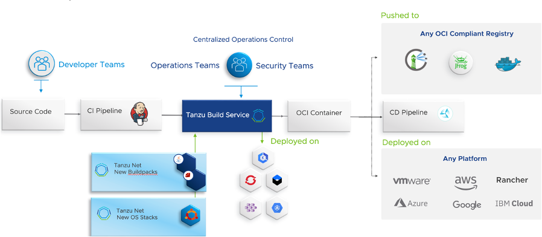

# **Session #2. CI/CD overview and Setup a TAP**
- Host : Hong Seok Kang
- Date : TBD
- Attendee : 
- Location : 
- Agenda
## **들어가기 전에 ..**

- Agile software declaration
https://agilemanifesto.org/iso/ko/manifesto.html 

```
우리는 소프트웨어를 개발하고, 또 다른 사람의 개발을
도와주면서 소프트웨어 개발의 더 나은 방법들을 찾아가고
있다. 이 작업을 통해 우리는 다음을 가치 있게 여기게 되었다:

공정과 도구보다 개인과 상호작용을
포괄적인 문서보다 작동하는 소프트웨어를
계약 협상보다 고객과의 협력을
계획을 따르기보다 변화에 대응하기를

가치 있게 여긴다. 이 말은, 왼쪽에 있는 것들도 가치가 있지만,
우리는 오른쪽에 있는 것들에 더 높은 가치를 둔다는 것이다.
```

- Waterfall vs Agile

> Software development methodology introduces a specific process that needs to be followed for successfully designing, developing, testing, delivering, deploying, and maintaining software products. 

- Waterfall development methodology

    - 장점 : 요구 사항이 사전에 정의되면, 모든 팀원이 미리 이해하고 진행, 프로젝트 관리가 용이 , 
    - 단점 : Moving backward 가 어려움, 요구 사항 변경시 전체 프로세스 다시 시작, testing, reporting, fixing, retesting, and launching time 이 길어짐

이미지 출처 : https://www.netsolutions.com/insights/top-3-software-development-methodologies-pros-cons/ 


- Agile development methodology

무엇보다도 애자일은 소프트웨어 개발 프로세스에 관한 사고방식입니다. 애자일은 원활히 작동하는 소프트웨어를 제공하는 것이 목표라는 점과 변화를 수용하고 개인들 간의 협업을 장려하는 것이 계약된 요구사항에 따라 만들어진 계획을 엄격히 따라가는 것보다 더 효율적인 방법이라는 점을 인식합니다.
애자일 선언에 설명된 원칙은 이런 가치를 상세히 설명하며 이를 시행하기 위한 기술도 제공합니다. 여기에는 역량 있고 협력하는 팀을 만들고 팀이 변화에 대응할 수 있도록 빈번하게 반복적인 주기로 잘 작동하는 소프트웨어를 제공하는 것이 포함됩니다.
이유는 간단합니다. 착수 시에 요구사항을 못박아 버리고 이를 위해 계획을 엄격히 따르면 더 많은 것을 알아가고 사용자들의 환경이나 수요가 변화할 때 빌드 중인 제품을 이에 적응시킬 유연성을 잃게 됩니다. 애자일 접근법은 최종 목표를 설정하고 점진적으로 이를 달성할 방법을 구체적으로 찾는 것입니다.

    - 장점 : 
    - 단점 : 

이미지 출처 : https://www.netsolutions.com/insights/top-3-software-development-methodologies-pros-cons/ 

- 스크럼 이해
    1. 개요
        스크럼은 복잡한 제품을 개발(배포)하고, 유지하기 위한 프레임워크 
        비즈니스 요구를 충족시키는데 초점을 맞추기 위해, 작은 목표를 짧은 주기로 점진적이며 경험적으로 제품을 지속적으로 개발(전달)하는 관리 프레임워크(기법)
        사람들이 효과적으로 성취감을 충족하며 협업할 수 있게하여, 복잡하고 정교한 제품을 생산

    2. 주요 특징
        솔루션에 포함할 기능/개선점에 대한 우선 순위를 부여한다.
        개발 주기는 1~4주 정도로 하고 개발 주기마다 실제 동작할 수 있는 결과를 제공하라.
        개발 주기마다 적용할 기능이나 개선에 대한 목록을 제공하라.
        매일 15분 정도의 Scrum meeting 회의를 가져라.
        항상 팀을 우선으로 생각하라.
        원활한 의사소통을 위하여, 구분 없는 열린 공간과 마음을 유지하라.

        
        이미지 출처 : https://www.scrum.org/resources/blog/5-scrum-values-take-center-stage 

https://medium.com/dtevangelist/scrum-dfc6523a3604 

- What is the Best Software Development Methodology?

We discussed the top seven software development models here, but it still does not trim the confusion around which should be chosen when. So, here’s are the most suitable use cases for different software development methodologies:

Use Waterfall — 요구 사항이 고정되어 있고, 시간과 예산이 여유가 있을 때 
Use Agile — 요구 사항이 가변적이거나 정의되기 어려울 때, 증분 개발 방식이 요구될 때, 

- Devops 등장 및 특징
개발 팀들이 애자일 원칙을 수용함으로써 소프트웨어 개발 접근법을 크게 바꾸는 동안 하위 프로세스에서 팀들이 협업을 적게 하는 경향이 있었습니다. 인프라를 관리하고 소프트웨어를 라이브로 배포하는 운영팀과 코드를 작성하는 개발자들과는 전혀 다른 방식이나 언어로 작업하는 것이 드물지 않았습니다.

DevOps는 애플리케이션과 서비스를 빠른 속도로 제공할 수 있도록 조직의 역량을 향상시키는 문화 철학, 방식 및 도구의 조합입니다. 기존의 소프트웨어 개발 및 인프라 관리 프로세스를 사용하는 조직보다 제품을 더 빠르게 혁신하고 개선할 수 있습니다. 이러한 빠른 속도를 통해 조직은 고객을 더 잘 지원하고 시장에서 좀 더 효과적으로 경쟁할 수 있습니다.

- 키워드
    - 작은 단위로 개발
    - 반복적으로 수행 (개발/테스트/배포)
    - 유연성과 변화에 빠른 대응
    - 협업과 신속한 피드백 중시


- Devops vs DevSecOps
https://peoplactive.com/devsecops-vs-devops-difference/ 

** What activities distinguish DevOps and DevSecOps ? **
    - Continuous Integration– consolidates code changes to guarantee the latest version is accessible to developers
    - Continuous delivery and continuous deployment– automates the most common way of delivering updates to increase efficiency
    - Microservices– build an application as a set of smaller services
    - Infrastructure as code (IaC)– planning, designing and implementing, and managing app infrastructure needs through code

** The DevSecOps approach incorporates the above features, as well as: **
    - Common weakness enumeration (CWE) – works on the quality of code and the degree of security during the CI/CD phases.
    - Threat Modeling – carries out security testing during the app development pipeline to save time and cost in future
    - Automated security testing – test for weaknesses in new builds regularly
    - Incident Management – makes a standard system for reacting to security occurrences

- CI/CD 등장
DevOps 실전 적용
자동화된 CI/CD 파이프라인을 만들면 이러한 DevOps 목표를 실전에 적용할 수 있습니다. 자주 커밋하는 지속적인 통합 관행은 파이프라인 내에서 빠르게 처리되는 작은 배치 사이즈를 권장합니다. 자동화된 빌드 및 테스트 시스템은 수동 프로세스보다 훨씬 빠르게 각 변경 사항을 검증하고 피드백을 제공합니다.

개발자가 작성한 코드에 대한 피드백을 빠르게 제공받는다면 변경 사항의 맥락을 놓칠 가능성이 낮아지므로 효율성이 높아지며 Lean에서 말하는 "흐름"을 유지할 수도 있습니다. 빈번한 자동화 테스팅 또한 버그를 빠르게 발견하고 수정함으로써 그 위에 다른 코드가 작성되는 것을 방지함으로써 품질을 개선하는 데 도움을 줍니다

- CI ? 

CI는 간단히 요약하자면 빌드/테스트 자동화 과정 과정입니다. CI는 개발자를 위한 자동화 프로세스인 지속적인 통합(Continuous Integration)을의미합니다. CI를 성공적으로 구현할 경우 애플리케이션에 대한 새로운 코드 변경 사항이 정기적으로 빌드 및 테스트되어 공유 리포지토리에 통합되므로 여러 명의 개발자가 동시에 애플리케이션 개발과 관련된 코드 작업을 할 경우 서로 충돌할 수 있는 문제를 해결할 수 있습니다.

지속적 통합의 실행은 소스/버전 관리 시스템에 대한 변경 사항을 정기적으로 커밋하여 모든 사람에게 동일 작업 기반을 제공하는 것으로 시작합니다. 커밋할 때마다 빌드와 일련의 자동 테스트가 이루어져 동작을 확인하고 변경으로 인해 문제가 생기는 부분이 없도록 보장합니다. 지속적 통합은 그 자체로 유익하지만 CI/CD 파이프라인을 구현하기 위한 첫 번째 단계이기도 합니다.

핵심 요소
    소스 코드 파일, 라이브러리, 구성 파일 및 스크립트를 포함하여 전체 코드 베이스를 포함하는 소스 또는 버전 관리 시스템
    자동화된 빌드 스크립트
    자동화된 테스트
    빌드 및 테스트를 실행할 인프라

- CD ? 
CD는 간단히 말하면 배포 자동화 과정입니다. CD는 지속적인 서비스 제공(Continuous Delivery) 또는 지속적인 배포(Continuous Deployment)를 의미하며 이 두 용어는 상호 교환적으로 사용됩니다. 두 가지 의미 모두 파이프라인의 추가 단계에 대한 자동화를 뜻하지만 때로는 얼마나 많은 자동화가 이루어지고 있는지를 설명하기 위해 별도로 사용되기도 합니다.

지속적 배포는 빌드, 테스트 및 배포 단계를 자동화하는 DevOps 방식을 논리적 극한까지 끌어 올립니다. 코드 변경이 파이프라인의 이전 단계를 모두 성공적으로 통과하면 수동 개입 없이 해당 변경 사항이 프로덕션에 자동으로 배포됩니다. 지속적 배포를 채택하면 품질 저하 없이 최대한 빨리 사용자에게 새로운 기능을 제공할 수 있습니다.

지속적 배포는 또한 성숙하고 입증된 지속적 통합 및 지속적인 전달 단계를 기반으로 합니다. 간단한 코드 변경이 정기적으로 마스터에 커밋되고, 자동화된 빌드 및 테스트 프로세스를 거치며 다양한 사전 프로덕션 환경으로 승격되며, 문제가 발견되지 않으면 최종적으로 배포됩니다. 강력하고 신뢰할 수 있는 자동화 배포 파이프라인을 구축하면 하루에도 여러 번 이루어지는 릴리스가 특별하지 않은 일상이 됩니다.

- CI/CD Pipeline

> CI/CD 파이프라인이라고 하면, 개발 머신에서 테스트와 스테이징을 거쳐 최종적으로 출시하여 사용자에게 전달하기 위해 코드가 거치는 일련의 단계를 말합니다. 정기적으로(일반적으로 하루에 여러 번) 실행 , 다음 단계별 트리깅 또는 플래그 표시(실패시) 등 가능한 한 많은 프로세스를 자동화하는 것이 키

CI/CD는 가능한 한 빨리 이슈를 강조 표시하여 소프트웨어 개발 효율성을 높입니다. 즉, 상호 작용을 앞당기고 피드백을 더 빨리 받음으로써 빠르게 페일하도록 도와줍니다(즉, Shifting Left: 보안 조기 도입). 자동화된 파이프라인을 구축하면 이러한 기술을 활용할 수 있습니다.

- CI /CD Pipeline with VM or Container
With VM => 빌드된 어플리케이션이 인프라에 배포
With Container => 소스 빌드외  컨테이너 이미지 빌드 단계 필요 , 컨테이너 빌드 후 적절한 오케스트레이션 툴을 통해 실제 인프라 배포 


- TAP Overview



Component documentation

https://docs.vmware.com/en/VMware-Tanzu-Application-Platform/1.1/tap/GUID-components.html 
